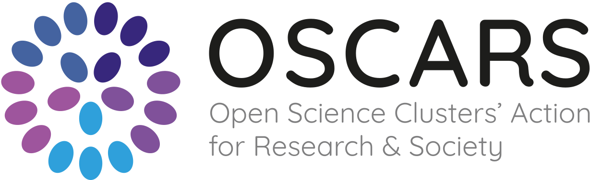

# VALT Long-Reads Summer School
</a>

## 👋 Welcome

Welcome to the **VALT Bioinformatics Summer School on Analysis of Long-Reads Technology Data**.

We have organized a comprehensive 3-day course designed for master's students, doctoral candidates, and early career postdoctoral fellows interested in exploring the exciting world of long-read RNA sequencing. Throughout this course, you will be introduced to a diverse range of topics—from fundamental technologies and basic data processing to advanced applications including long-read transcriptome reconstruction, single-cell analysis, and many other exciting topics.

### 📃 Table of Contents

- [🤔 What Will You Learn?](#-what-will-you-learn)
- [🧑‍🔬 Who Should Attend?](#-who-should-attend)
- [📚 Course Prerequisites](#-course-prerequisites)
- [🗓️ Workshop Schedule](#-workshop-schedule)

---

## 🤔 What Will You Learn?

* **Technologies & Fundamentals**
  * Comprehensive overview of different long-read sequencing technologies
  * Best practices in experimental design
  * Quality control evaluation using SQANTI-reads

* **Analysis & Applications**
  * Transcript identification and quantification using long reads
  * Structural annotation evaluation  
  * Differential expression analysis and haplotype identification
  * RNA modifications detection with long reads

* **Advanced Topics**
  * Single-cell transcriptomics approaches
  * Principles and practical applications of metatranscriptomics

## 🧑‍🔬 Who Should Attend?

This training is specifically designed for early career researchers who are:
* In the grant application phase for long-read sequencing projects
* Planning experimental design for studies centered around long-read technologies
* Looking to expand their bioinformatics toolkit with cutting-edge long-read analysis methods

## 📚 Course Prerequisites

* **Required Skills**: Familiarity with command line interfaces
* Participants should be comfortable with basic Unix shell commands as taught in the [Software Carpentry lesson on The Unix Shell](https://swcarpentry.github.io/shell-novice/)
* We recommend working through these materials before the training if you need to refresh your skills

## 🗓️ Workshop Schedule

### Day 1 - Foundation day

| Time          | Session                                                                                    |
|--------------|--------------------------------------------------------------------------------------------|
| 09:00 - 12:30 | **Lecture**:     Different long-read sequencing technologies, experimental design, quality, mapping     **Lecturers:** Ana Conesa |
| 12:30 - 13:30 | *Lunch Break*                                                                               |
| 13:30 - 17:00 | **Hands-on**:    Different long-read mappers and QC evaluation with SQANTI-reads    **Lecturers:** Carol and Tian  |

### Day 2 Transcript Analysis Day

| Time          | Session                                                                                    |
|--------------|--------------------------------------------------------------------------------------------|
| 09:00 - 12:30 | **Lecture & Hands-on**:    Transcript identification and quantification using long reads    **Lecturers:** Yalan and Ana |
| 12:30 - 13:30 | *Lunch Break*                                                                               |
| 13:30 - 17:00 | **Lecture & Hands-on**:    Evaluation of structural annotation using long reads RNA sequences    **Lecturers:** Pablo |

### Day 3 Advanced Analysis Day

| Time          | Session                                                                                    |
|--------------|--------------------------------------------------------------------------------------------|
| 09:00 - 12:30 | **Lecture & Hands-on**:    Differential expression and haplotype analysis using long reads    **Lecturers:** Nadja and Pablo  |
| 12:30 - 13:30 | *Lunch Break*                                                                               |
| 09:00 - 12:30 | **Lecture & Hands-on**:    Single-cell transcriptomics with long reads    **Lecturers:** Eamon and Fran  |

## Organizers
* [Ana Conesa](https://www.linkedin.com/in/ana-conesa-557b1a12/)
* [Pablo Atienza](https://www.linkedin.com/in/pablo-atienza-lopez/)
* [Clara Rodríguez](https://www.linkedin.com/in/clararodriguezbiologist/)
* [LongTREC Consortium](https://longtrec.eu/)

 </a>
 </a>
---

We thank Pedro Fernandes for providing this template and his training session to prepare this course:
https://www.linkedin.com/in/pedrofernandesbioinformatics/  
https://orcid.org/0000-0003-2124-0241  
pmlfern@gmail.com